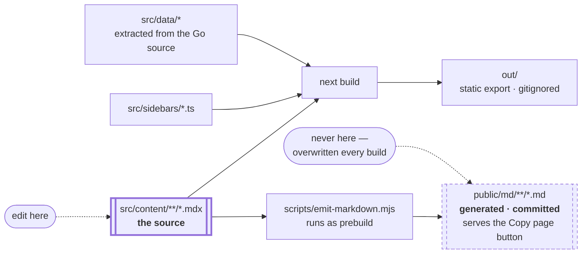

# skyl documentation

The documentation site for [skyl](https://github.com/BAGOMBEKA-JOB-DEV/skyl) —
*one Go interface for every AI model*.

Built with Next.js 15 (App Router). Two tracks — **Learn** for narrative,
read-in-order material and **Reference** for one page per symbol — sharing a
strict set of page templates and an MDX component vocabulary owned in this
repository.

## Running it

```bash
npm install
npm run dev          # http://localhost:3000
```

## Verifying it

```bash
npm run verify       # lint, typecheck, unit tests, build, links, snippets
```

Individually:

| Command | What it proves |
|---|---|
| `npm run lint` | ESLint, flat config |
| `npm run typecheck` | TypeScript, strict, `noUncheckedIndexedAccess` |
| `npm run test` | Vitest over the data layer |
| `npm run build` | Static export succeeds |
| `npm run check:links` | Every sidebar entry has a page, every page is linked, every internal link resolves, no placeholders |
| `npm run check:snippets` | **Every `verify` Go snippet compiles against the real library** |
| `npm run test:e2e` | Playwright walks every route and exercises search, theming, tabs and the matrix |

### The snippet checker

`scripts/check-snippets.mjs` extracts every fenced Go block marked `verify`,
assembles each into its own package with a `replace` onto a local skyl checkout,
and type-checks it.

```bash
node scripts/check-snippets.mjs --skyl ../skyl
node scripts/check-snippets.mjs --keep      # leave .snippet-check/ for debugging
```

`verify` renders a **Compiles** badge, so it means exactly one thing: this
snippet type-checks standalone. Snippets that are excerpts — referring to a
helper defined three paragraphs earlier — deliberately do not carry it, and
`scripts/demote-snippets.mjs` strips the marker from any that stop compiling.

It skips with a message rather than failing when Go or the skyl checkout is
absent, and adapts to the local toolchain: `provider/anthropic` needs Go 1.24,
so on an older toolchain a stub stands in and the core is still verified against
its real 1.22 floor.

## Structure

```
src/
├── app/            Next App Router — (home), learn, reference, community
├── components/
│   ├── mdx/        The component vocabulary: Intro, YouWillLearn, Recap,
│   │               Challenges, DeepDive, Pitfall, ProviderTabs, GoExample…
│   ├── layout/     Header, sidebar, TOC, breadcrumbs, search, prev/next
│   ├── home/       Hero and the animated provider swap
│   └── feature-matrix/  The interactive matrix
├── content/        160 MDX pages
├── data/           Typed data extracted from the Go source — every table on
│                   the site renders from here rather than being hand-written
├── sidebars/       learn.ts, reference.ts, community.ts, blog.ts
├── lib/            MDX pipeline, Shiki highlighting, search index
└── config/site.ts  Version, module table, top nav
```

### How a page becomes a file

Worth knowing before editing anything, because one of the outputs is committed,
looks editable, and is not:



`public/md/` holds 166 committed `.md` files. They are **generated** from the
MDX by `prebuild`, so a hand edit survives exactly until the next
`npm run build` and then disappears with no diff to explain it. Edit the MDX.

## Adding a page

1. Add an entry to the relevant file in `src/sidebars/`.
2. Create the MDX at the matching path under `src/content/`.
3. Run `npm run check:links` — it fails if the two disagree.

Frontmatter needs a `title`; `description` and `badge` are optional.

## Writing content

**Learn pages** follow: `<Intro>` → `<YouWillLearn>` → narrative → `<Recap>` →
`<Challenges>` with `<Hint>` and `<Solution>`.

**Reference pages** follow: `<Intro>` → **Reference** (`<Signature>`,
`<Parameters>`, `<Returns>`, `<Caveats>`) → **Usage** (`<Recipe>`) →
**Troubleshooting** (`<Trouble>`).

Tables come from `src/data/` through the components in
`src/components/mdx/data-views.tsx` — never hand-write a grid, or the same fact
drifts between pages.

Mark a Go fence `verify` when it should compile:

````
```go title="main.go" verify
client := skyl.New(openai.New(key))
```
````

## Deployment

`npm run build` produces a fully static export in `out/` — no Node server at
runtime. Copy that directory to any static host: nginx, S3, Netlify, Vercel,
Cloudflare Pages.

Set `SITE_URL` to the origin the site will be served from. It becomes the
canonical URL in `sitemap.xml` and `robots.txt` and the `og:url` on every page;
unset, it falls back to `http://localhost:3000`, which is right for local work
and wrong for anything published.

```bash
SITE_URL=https://docs.example.com npm run build
```

CI (`.github/workflows/ci.yml`) runs lint, typecheck, unit tests, the build, the
link check, the Go snippet compiler and the end-to-end suite, and uploads `out/`
as a build artefact — so a built site is downloadable from any run without a
deployment step.

Deploying the *gateway* is a different problem and lives elsewhere — see
[skyl_infrastructure](https://github.com/BAGOMBEKA-JOB-DEV/skyl_infrastructure).
This section is only about the site.

## The three repositories

| Repository | What it is |
|---|---|
| [skyl](https://github.com/BAGOMBEKA-JOB-DEV/skyl) | The Go library, the adapters, and the gateway — the thing being documented |
| **[skyl_docs](https://github.com/BAGOMBEKA-JOB-DEV/skyl_docs)** | This one — the [documentation site](https://skyl-docs.vercel.app/) |
| [skyl_infrastructure](https://github.com/BAGOMBEKA-JOB-DEV/skyl_infrastructure) | Deployment: Terraform for AWS/GCP/Azure, the Helm chart, CI |

The split is deliberate: a docs change never touches the library's release
history, and neither does an infrastructure change. The cost is that the same
fact can drift across three repositories — which is why `check:snippets`
compiles every `verify` Go block against a real skyl checkout rather than
trusting that the prose kept up.

**Diagrams differ between repositories, on purpose.** Here they are React
components — `Diagram`, `AsciiDiagram`, `ClientStackDiagram` in
`src/components/mdx/diagram.tsx` — rendered as inline SVG or pre-formatted ASCII
so they inherit the page theme and scale with the reader's font size. An image
would be wrong in one theme or the other. The two GitHub-only repositories use
mermaid in markdown instead, because GitHub renders it natively and there is no
build step to hook. A diagram does not move between the two unchanged.

## Licence

Documentation is CC BY 4.0; skyl itself is Apache 2.0.
